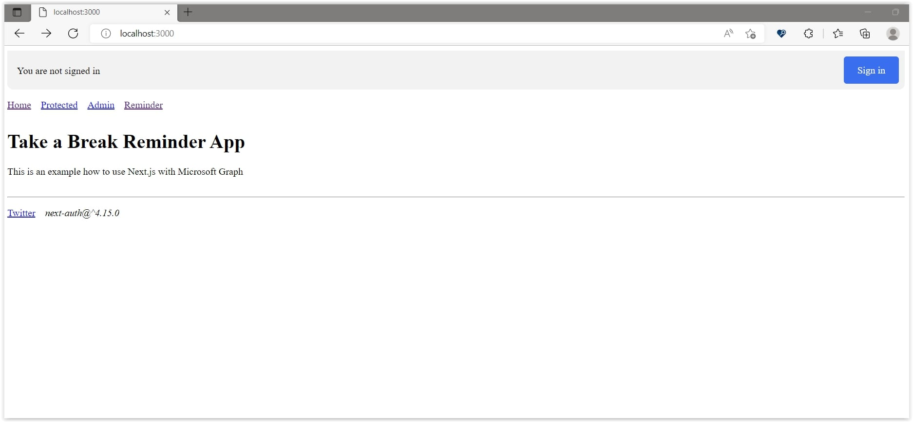
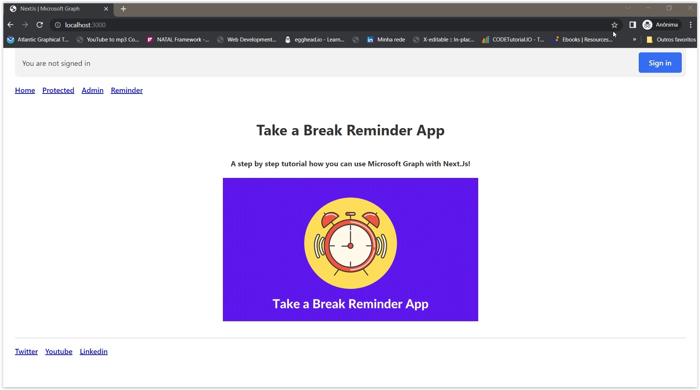

# Reminder App - A Step by Step Tutorial

*(put picture about the application here)*

In this tutorial we will learn how to use Microsoft Graph integrated with Next.js.

But first we need to understand what Microsoft Graph is.

Microsoft Graph is an API that allows you to access data and services from Microsoft 365. You can use the Microsoft Graph API to build applications that interact with millions of users around the world, accessing data in a consistent way across the Microsoft 365 ecosystem.

*(write here about Microsoft Graph - including some images)*

Now that we already understand what Microsoft Graph is, let's start creating our application.

## Take a Break Reminder App. What is it? What does it do?

This application is a reminder of time intervals for you to get up and take a break. The application will remind you to take a break every 60 minutes. The application will show a notification on your computer screen and will also send you an email.

*(explain what the application does)*

## Resources used

*(list all resources used during the development of the application)*

## Prerequisites

Before anything, before creating our application, we will need to do some things first.

One of them is, create an account on the Microsoft 365 Developer Program. **[LINK HERE](https://developer.microsoft.com/en-us/microsoft-365/dev-program)**. Don't worry. This account is totally free!

If you have any doubts on how to create the account, you can watch this video **[HERE](https://www.youtube.com/watch?v=JvWLgirC8xs)**. Because it explains very well how to create the account.

## Creating the application on the Azure Portal

Now we need to follow the steps below to create the application on the Azure portal.

*(put step by step with images as how to create the application on Azure, included the environments of the application)*

Perfect! Now we can start to code our application! 

## Let's Code!

Once we already created our application on the Azure portal, we can start to code our application. In this tutorial we will use Next.js. But you can use any other framework you want. Let's install the Next.js framework.

Open your terminal and run the following command:

```bash
npx create-next-app reminder-app --typescript 
```

Now we already have our application created. Let's execute it to see if everything is working.

```bash
cd reminder-app
npm run dev
```

```bash
npm run dev
```

Open the browser and go to the following address: [http://localhost:3000](http://localhost:3000).

Now we need to install some dependencies. And one of them is the [Microsoft Graph Client](https://learn.microsoft.com/en-us/graph/sdks/create-client?tabs=Javascript). To install it, run the following command:

```bash
npm install @microsoft/microsoft-graph-client
```

If you want to know more about the Microsoft Graph Client, you can read the documentation **[HERE](https://docs.microsoft.com/en-us/graph/sdks/sdks-overview)**. And also, know about the NPM package **[HERE](https://www.npmjs.com/package/@microsoft/microsoft-graph-client)**.

Another package we will need to install is NextAuth. It is a library that helps us to integrate authentication with Next.js. To install it, run the following command:

```bash
npm install next-auth
```

Also, if you want to know more about NextAuth, you can read the documentation **[HERE](https://next-auth.js.org/)**. And also, know about the NPM package **[HERE](https://www.npmjs.com/package/next-auth)**.

Now we can finally start coding our application.

## Creating the Application Components

Now let's make some changes to our application. In this moment we are not going to use none UI framework. So, let's start creating some components.

Every application needs a Layout. So, let's create a Layout component. Create a folder called `components` and inside it create these files:

- `layout.module.css`
- `layout.tsx`

The `layout.module.css` file will be used to style our Layout component. And the `layout.tsx` file will be used to create our Layout component.

* `layout.tsx`

<details><summary><b>components/Layout/layout.tsx</b></summary>
<br/>

```tsx
/**
 * file: components/Layout/layout.tsx
 * description: file responsible for the 'Layout' component
 * data: 10/26/2022
 * author: Glaucia Lemos <Twitter: @glaucia_lemos86>
 */

import Header from '../Header/header';
import Footer from '../Footer/footer';
import React, { ReactNode } from 'react';

interface LayoutProps {
  children: ReactNode;
}

export default function Layout({ children }: LayoutProps) {
  return (
    <>
      <Header />
      <main>{children}</main>
      <Footer />
    </>
  );
}
```
</details>
<br/>

Hold on! It's not over yet. We need to create the `Header` and `Footer` components. So, let's create them.

* `header.module.css`
* `header.tsx`

<details><summary><b>components/Header/header.module.css</b></summary>
<br/>

```css
.signedInStatus {
  display: block;
  min-height: 4rem;
  width: 100%;
}

.loading,
.loaded {
  position: relative;
  top: 0;
  opacity: 1;
  overflow: hidden;
  border-radius: 0 0 0.6rem 0.6rem;
  padding: 0.6rem 1rem;
  margin: 0;
  background-color: rgba(0, 0, 0, 0.05);
  transition: all 0.2s ease-in;
}

.loading {
  top: -2rem;
  opacity: 0;
}

.signedInText,
.notSignedInText {
  position: absolute;
  padding-top: 0.8rem;
  left: 1rem;
  right: 6.5rem;
  white-space: nowrap;
  text-overflow: ellipsis;
  overflow: hidden;
  display: inherit;
  z-index: 1;
  line-height: 1.3rem;
}

.signedInText {
  padding-top: 0rem;
  left: 4.6rem;
}

.avatar {
  border-radius: 2rem;
  float: left;
  height: 2.8rem;
  width: 2.8rem;
  background-color: white;
  background-size: cover;
  background-repeat: no-repeat;
}

.button,
.buttonPrimary {
  float: right;
  margin-right: -0.4rem;
  font-weight: 500;
  border-radius: 0.3rem;
  cursor: pointer;
  font-size: 1rem;
  line-height: 1.4rem;
  padding: 0.7rem 0.8rem;
  position: relative;
  z-index: 10;
  background-color: transparent;
  color: #555;
}

.buttonPrimary {
  background-color: #346df1;
  border-color: #346df1;
  color: #fff;
  text-decoration: none;
  padding: 0.7rem 1.4rem;
}

.buttonPrimary:hover {
  box-shadow: inset 0 0 5rem rgba(0, 0, 0, 0.2);
}

.navItems {
  margin-bottom: 2rem;
  padding: 0;
  list-style: none;
}

.navItem {
  display: inline-block;
  margin-right: 1rem;
}
```
</details>
<br/>

We won't go into details about the css. 

Now let's focus on the `header.tsx` file. Open the `header.tsx` file and add the following code:

<details><summary><b>components/Header/header.tsx</b></summary>
<br/>

```tsx
/**
 * file: components/Header/header.tsx
 * description: file responsible for the 'Header' component
 * data: 10/26/2022
 * author: Glaucia Lemos <Twitter: @glaucia_lemos86>
 */

import Link from 'next/link';
import { signIn, signOut, useSession } from 'next-auth/react';
import styles from './header.module.css';

export default function Header() {
  const { data: session, status } = useSession();
  const loading = status === 'loading';

  return (
    <header>
      <noscript>
        <style>{`.nojs-show { opacity: 1; top: 0; }`}</style>
      </noscript>
      <div className={styles.signedInStatus}>
        <p
          className={`nojs-show ${
            !session && loading ? styles.loading : styles.loaded
          }`}
        >
          {!session && (
            <>
              <span className={styles.notSignedInText}>
                You are not signed in
              </span>
              <a
                href={`/api/auth/signin`}
                className={styles.buttonPrimary}
                onClick={(e) => {
                  e.preventDefault();
                  signIn();
                }}
              >
                Sign in
              </a>
            </>
          )}
          {session?.user && (
            <>
              {session.user.image && (
                <span
                  style={{ backgroundImage: `url('${session.user.image}')` }}
                  className={styles.avatar}
                ></span>
              )}
              <span className={styles.signedInText}>
                <small>Signed in as</small>
                <br />
                <strong>{session.user.email ?? session.user.name}</strong>
              </span>
              <a
                href={`/api/auth/signout`}
                className={styles.button}
                onClick={(e) => {
                  e.preventDefault();
                  signOut();
                }}
              >
                {' '}
                Sign Out
              </a>
            </>
          )}
        </p>
      </div>
      <nav>
        <ul className={styles.navItems}>
          <li className={styles.navItem}>
            <Link href='/'>Home</Link>
          </li>
          <li className={styles.navItem}>
            <Link href='/admin'>Admin</Link>
          </li>
          <li className={styles.navItem}>
            <Link href='/reminder'>Reminder</Link>
          </li>
        </ul>
      </nav>
    </header>
  );
}
```
</details>
<br/>

If you look at the code above, you'll see that we're using the `useSession` hook to get the session data. We're also using the `signIn` and `signOut` functions to sign in and out of the application. And also we are using the `status` variable to check if the session is loading or not.

You will see we are using `session?.user` to check if the user is signed in or not. If the user is signed in, we will show the user's name and email address. If the user is signed in we will show the `Sign Out` button to log out of the application.

Inside in the `return` block code we are using React. And also, we are using the `Link` component from Next.js to navigate between pages.

And finally, let's create the Footer component. Open the `components` folder and create a new folder called `Footer`. Inside in the `Footer` folder, create these files:


- `footer.module.css`
- `footer.tsx`

<details><summary><b>components/Footer/footer.module.css</b></summary>
<br/>

```css
.footer {
  margin-top: 2rem;
}

.navItems {
  margin-bottom: 1rem;
  padding: 0;
  list-style: none;
}

.navItem {
  display: inline-block;
  margin-right: 1rem;
}
```

</details>
<br/>

<details><summary><b>components/Footer/footer.tsx</b></summary>
<br/>

```tsx
import styles from '../Footer/footer.module.css';

export default function Footer() {
  return (
    <footer className={styles.footer}>
      <hr />
      <ul className={styles.navItems}>
        <li className={styles.navItem}>
          <a href='https://twitter.com/glaucia_lemos86'>Twitter</a>
        </li>
        <li className={styles.navItem}>
          <a href='https://twitter.com/glaucia_lemos86'>Youtube</a>
        </li>
        <li className={styles.navItem}>
          <a href='https://twitter.com/glaucia_lemos86'>Linkedin</a>
        </li>
      </ul>
    </footer>
  );
}
```

</details>
<br/>

It's a simple footer component. But if you want to add more things to it, feel free to do it.

But what if the user is not logged in? So what happens?  We have to create a page that says the user does not have permission to access the page. Shall we create it? Let's do it!

Inside the `components` folder, create a new folder called `AccessDenied`. Inside in this folder, create the file: 

- `access-denied.tsx`

<details><summary><b>components/AccessDenied/access-denied.tsx</b></summary>
<br/>

```tsx
/**
 * file: components/AccessDenied/access-denied.tsx
 * description: file responsible for the 'AccessDenied' component.
 * data: 10/26/2022
 * author: Glaucia Lemos <Twitter: @glaucia_lemos86>
 */

import { signIn } from 'next-auth/react';

export default function AccessDenied() {
  return (
    <>
      <h1>Access Denied</h1>
      <p>
        <a
          href='/api/auth/signin'
          onClick={(e) => {
            e.preventDefault();
            signIn();
          }}
        >
          You must be signed in to view this page
        </a>
      </p>
    </>
  );
}
```

</details>
<br/>

Again! It's a simple component. When we finish this whole tutorial, we can add some UI to it. But for now, let's keep it simple, using Material UI.

As we are using TypeScript in this application, we need to transpile the code. So let's do it! Open the terminal and run the following command:

```bash
npm run build
```

And then run the following command:

```bash
npm run dev
```

You will see the screen it still the same. But why? Because we haven't created the pages yet. So let's do it!

## Defining AAD Provider in Next.js

Before we start creating the pages, we need to define the AAD provider in NextAuth. For this, inside the `pages/api` folder create a new folder called `auth`. Inside in this folder, create the file `[...nextauth]].ts` and add the following code:

* `pages/api/auth/[...nextauth].ts`

<details><summary><b>pages/api/auth/[...nextauth].ts</b></summary>
<br/>

```tsx
/**
 * file: pages/api/auth/[...nextauth].ts
 * description: file responsible for the authenticate an user using AAD Provider
 * data: 10/28/2022
 * author: Glaucia Lemos <Twitter: @glaucia_lemos86>
 */

import NextAuth, { NextAuthOptions } from "next-auth";
import AzureADProvider from 'next-auth/providers/azure-ad';

export const authOptions: NextAuthOptions = {
  providers: [
    AzureADProvider({
      clientId: process.env.AZURE_AD_CLIENT_ID,
      clientSecret: process.env.AZURE_AD_CLIENT_SECRET,
      tenantId: process.env.AZURE_AD_TENANT_ID,
    })
  ]
}

export default NextAuth(authOptions);
```
</details>
<br/>

Now we need to use the environment variables that we created before in AAD portal. So let's create the `.env.local` file in the root of the project and add the following code:

* `.env.local`

```text
AZURE_AD_CLIENT_ID=xxxxxxxx-xxxx-xxxx-xxxx-xxxxxxxxxxxx
AZURE_AD_CLIENT_SECRET=xxxxxxxxxxxxxxxxxxxxxxxxxxxxxxxxxxxxxxxxxxxx
AZURE_AD_TENANT_ID=xxxxxxxx-xxxx-xxxx-xxxx-xxxxxxxxxxxx
NEXTAUTH_URL=http://localhost:3000
NEXTAUTH_SECRET=123
```

If you want, I created a file called `.env.local.template` as sample. You can use as a reference.

Now we need to configure the main project in the project. So let's do it! Open the `pages/_app.tsx` file and add the following code:

* `pages/_app.tsx`

<details><summary><b>pages/_app.tsx</b></summary>
<br/>

```tsx
/**
 * file: pages/_app.tsx
 * description: file responsible for the application's configuration
 * data: 10/26/2022
 * author: Glaucia Lemos <Twitter: @glaucia_lemos86>
 */

import { SessionProvider } from 'next-auth/react';

import type { AppProps } from 'next/app';
import type { Session } from 'next-auth';

export default function App({
  Component,
  pageProps: { session, ...pageProps },
}: AppProps<{ session: Session }>) {
  return (
    <SessionProvider session={session}>
      <Component {...pageProps} />
    </SessionProvider>
  );
}
```

</details>
<br/>

We are here defining the `SessionProvider` from the NextAuth. It is responsible for managing the session of the user. 

Now let's run the application again e then open the browser and access the following URL: `http://localhost:3000`. If you see the following screen, it means that everything is working fine:



Page links are still not working. But we will fix it in the next section. Let's create these pages now!

## Creating the pages for the application

Now, let's create the pages for the application. Open the `pages` folder and create the following files:

- `styles.css`
- `admin.tsx`
- `reminder.tsx`

And to improve the application's css a little bit more, let's add the following code in the `styles.css` file:

* `styles.css`

<details><summary><b>styles.css</b></summary>
<br/>

```css
body {
  font-family: ui-sans-serif, system-ui, -apple-system, BlinkMacSystemFont,
    'Segoe UI', Roboto, 'Helvetica Neue', Arial, 'Noto Sans', sans-serif,
    'Apple Color Emoji', 'Segoe UI Emoji', 'Segoe UI Symbol', 'Noto Color Emoji';
  padding: 0 1rem 1rem 1rem;
  max-width: 100%;
  height: auto;
  margin: 0 auto;
  background: #fff;
  color: #333;
}

li,
p {
  line-height: 1.5rem;
}

a {
  font-weight: 500;
}

hr {
  border: 1px solid #ddd;
}

iframe {
  background: #ccc;
  border: 1px solid #ccc;
  height: 10rem;
  width: 100%;
  border-radius: 0.5rem;
  filter: invert(1);
}
```

</details>
<br/>

Return to the `_app.tsx` file and let's add the style that we recently created. So import the 

* `pages/_app.tsx`

<details><summary><b>pages/_app.tsx</b></summary>
<br/>

```tsx
import './styles.css';

(... some code here ...)
```

</details>
<br/>

And also, create e folder called `styles` in the root of the project and create the file `Home.module.css` and add the following code:

* `styles/Home.module.css`

<details><summary><b>styles/Home.module.css</b></summary>
<br/>

```css
.container {
  min-height: 50vh;
  display: flex;
  flex-direction: column;
  justify-content: center;
  align-items: center;
}

.main {
  flex: 1;
  display: flex;
  flex-direction: column;
  justify-content: center;
  align-items: center;
}

.title {
  margin: 5% 0;
  line-height: 1.15;
  font-size: 2rem;
  margin-bottom: 2rem;
  text-align: center;
}
```

</details>
<br/>

I created an image to include in the home page. If you want to use it, you can get from the repository of this project inside the `public` folder. The images is called `reminder.gif`.

Now, let's create Admin page. Open the `pages/admin.tsx` file and add the following code:

* `pages/admin.tsx`

<details><summary><b>pages/admin.tsx</b></summary>
<br/>

```tsx
/**
 * file: pages/admin.tsx
 * description: file responsible for the admin page
 * data: 10/26/2022
 * author: Glaucia Lemos <Twitter: @glaucia_lemos86>
 */

import { useSession } from 'next-auth/react';
import Layout from '../components/Layout/layout';

export default function Page() {
  const { data } = useSession();

  return (
    <Layout>
      <h1>Admin Page</h1>
      <p>Only admin users can see this page.</p>
      <pre>{JSON.stringify(data, null, 2)}</pre>
    </Layout>
  );
}
```

</details>
<br/>

And let's make the same thing with the `reminder.tsx` file:

* `pages/reminder.tsx`

<details><summary><b>pages/reminder.tsx</b></summary>
<br/>

```tsx
/**
 * file: pages/reminder.tsx
 * description: file responsible for the reminder page
 * data: 10/26/2022
 * author: Glaucia Lemos <Twitter: @glaucia_lemos86>
 */

import { useSession } from 'next-auth/react';
import Layout from '../components/Layout/layout';

export default function ReminderPage() {
  const { data } = useSession();

  return (
    <Layout>
      <h1>Reminder Page</h1>
      <p>Only admin users can see this page.</p>
      <pre>{JSON.stringify(data, null, 2)}</pre>
    </Layout>
  );
}
```

</details>
<br/>

Now, let's make some important changes in the `index.tsx` file and add the following code:

* `pages/index.tsx`

<details><summary><b>pages/index.tsx</b></summary>
<br/>

```tsx
/**
 * file: pages/index.tsx
 * description: file responsible for the home page
 * data: 10/26/2022
 * author: Glaucia Lemos <Twitter: @glaucia_lemos86>
 */

import Head from 'next/head';
import Layout from '../components/Layout/layout';
import Image from 'next/image';
import reminderImage from '../public/images/reminder.gif';
import styles from '../styles/Home.module.css';

export default function IndexPage() {
  return (
    <Layout>
      <div className={styles.container}>
        <Head>
          <title>NextJs | Microsoft Graph</title>
        </Head>
        <main className={styles.main}>
          <h1>Take a Break Reminder App</h1>
          <h4>
            A step by step tutorial how you can use Microsoft Graph with
            Next.Js!
          </h4>
          <div>
            <Image
              priority={true}
              src={reminderImage}
              width={560}
              height={315}
              alt='a clock image with a reminder'
            />
          </div>
        </main>
      </div>
    </Layout>
  );
}
```

</details>
<br/>

Wow! How many changes, right? 😅 Let's try to understand what is happening here. First, we are importing the `Head` component from the `next/head` package. This component is responsible for adding the title of the page. So, we are adding the title of the page as `NextJs | Microsoft Graph`. Then, we are importing the `Layout` component that we created previously. And also, we are importing the `Image` component from the `next/image` package. This component is responsible for adding the image in the home page. So, we are adding the image that we created previously. And finally, we are importing the `Home.module.css` file that we created previously. 

Now run again the application and check the result:



Now in the root of the project, let's create a file called `process.d.ts`. This file is responsible for adding the environment variables that we created previously. So, add the following code:

* `process.d.ts`

<details><summary><b>process.d.ts</b></summary>
<br/>

```tsx
/**
 * file: process.d.ts
 * description: file responsible for the types of the process
 * data: 11/01/2022
 * author: Glaucia Lemos <Twitter: @glaucia_lemos86>
 */

declare namespace NodeJS {
  export interface ProcessEnv {
    NEXTAUTH_URL: string;
    NEXTAUTH_SECRET: string;
    AZURE_AD_CLIENT_SECRET: string;
    AZURE_AD_CLIENT_ID: string;
  }
}
``` 

</details>
<br/>

When in the project we have some protected routes/pages, we need to create a file called: `middleware.ts`. We just can access these protected routes/pages if we are authenticated. So, let's create this file and add the following code:

* `middleware.ts`

<details><summary><b>middleware.ts</b></summary>

```tsx
/**
 * file: middleware.ts
 * description: file responsible for the middleware protected
 *  pages/routes of the application
 * data: 11/01/2022
 * author: Glaucia Lemos <Twitter: @glaucia_lemos86>
 */

import { withAuth } from 'next-auth/middleware';

export default withAuth({
  callbacks: {
    authorized({ req, token }) {
      if (req.nextUrl.pathname === '/admin') {
        return token?.userRole === 'admin';
      }

      return !!token;
    },
  },
});

export const config = { matcher: ['/reminder'] };
```

</details>  
<br/>

Let's understand what is happening here. First, we are importing the `withAuth` function from the `next-auth/middleware` package. This function is responsible for protecting the routes/pages that we want. Then, we are exporting the `withAuth` function with the `callbacks` property. This property is responsible for checking if the user is authenticated or not. So, if the user is authenticated, we can access the protected pages. If the use is not an admin user, we can't access the `/admin` page. And if the user is not authenticated, we can't access the `/reminder` page. Just if it is logged in.

If you want to know more about the `middleware.ts` file, you can check the documentation of the `next-auth`: [HERE](https://next-auth.js.org/configuration/nextjs#middleware).

We need to make some important changes in the `admin.tsx` file. So, let's add the following code:

* `pages/admin.tsx`

<details><summary><b>pages/admin.tsx</b></summary>
<br/>

```tsx
/**
 * file: pages/admin.tsx
 * description: file responsible for the admin page
 * data: 10/26/2022
 * author: Glaucia Lemos <Twitter: @glaucia_lemos86>
 */

import { useState, useEffect } from 'react';
import { useSession } from 'next-auth/react';
import Layout from '../components/Layout/layout';
import AccessDenied from '../components/AccessDenied/access-denied';

export default function Page() {
  const { data: session } = useSession();
  const [content, setContent] = useState();

  useEffect(() => {
    const fetchData = async () => {
      const res = await fetch('/api/examples/admin-protected');
      const json = await res.json();
      if (json.content) {
        setContent(json.content);
      }
    };

    fetchData();
  }, [session]);

  if (!session) {
    return (
      <Layout>
        <AccessDenied />
      </Layout>
    );
  }

  return (
    <Layout>
      <h1>Admin Page</h1>
      <p>
        <strong>{content ?? '\u00a0'}</strong>
      </p>
    </Layout>
  );
}
```

</details>
<br/>

Next step, inside the `api` folder let's create a folder called `examples`. And inside this folder, let's create a file called `admin-protected.ts`. So, add the following code:

* `api/examples/admin-protected.ts`

<details><summary><b>api/examples/admin-protected.ts</b></summary>
<br/>

```tsx
/**
 * file: pages/api/examples/admin-protected.ts
 * description: file responsible for the admin protected example
 * data: 11/01/2022
 * author: Glaucia Lemos <Twitter: @glaucia_lemos86>
 */

import { unstable_getServerSession } from "next-auth/next"
import { authOptions } from "../auth/[...nextauth]"

import type { NextApiRequest, NextApiResponse } from "next"

export default async function handler(
  req: NextApiRequest,
  res: NextApiResponse
) {
  const session = await unstable_getServerSession(req, res, authOptions)

  if (session) {
    return res.send({
      content:
        "This is protected page. You can access this page because you are signed in.",
    })
  }

  res.send({
    error: "You must be signed in to view the protected page.",
  })
}
```

</details>
<br/>

And inside the `examples` folder, let's create a file called `session.ts`. So, add the following code:

* `api/examples/session.ts`

<details><summary><b>api/examples/session.ts</b></summary>
<br/>

```tsx
/**
 * file: pages/api/examples/session.ts
 * description: file responsible for the session example
 * data: 11/01/2022
 * author: Glaucia Lemos <Twitter: @glaucia_lemos86>
 */

import { unstable_getServerSession } from "next-auth";
import { authOptions } from "../auth/[...nextauth]";

import type { NextApiRequest, NextApiResponse } from "next";

export default async function handler(
  req: NextApiRequest,
  res: NextApiResponse
) {
  const session = await unstable_getServerSession(req, res, authOptions);
  res.send(JSON.stringify(session, null, 2));
}
```

</details>
<br/>

And finally, let's make some changes in the `reminder.tsx` and `admin.tsx` files. So, let's add the following code:

* `pages/admin.tsx`

<details><summary><b>pages/admin.tsx</b></summary>
<br/>

```tsx
/**
 * file: pages/admin.tsx
 * description: file responsible for the admin page
 * data: 10/26/2022
 * author: Glaucia Lemos <Twitter: @glaucia_lemos86>
 */

import { useState, useEffect } from 'react';
import { useSession } from 'next-auth/react';
import Layout from '../components/Layout/layout';
import AccessDenied from '../components/AccessDenied/access-denied';

export default function Page() {
  const { data: session } = useSession();
  const [content, setContent] = useState();

  useEffect(() => {
    const fetchData = async () => {
      const res = await fetch('/api/examples/admin-protected');
      const json = await res.json();
      if (json.content) {
        setContent(json.content);
      }
    };

    fetchData();
  }, [session]);

  if (!session) {
    return (
      <Layout>
        <AccessDenied />
      </Layout>
    );
  }

  return (
    <Layout>
      <h1>Admin Page</h1>
      <h2>Welcome, {session.user?.name}!</h2>
      <p>
        <strong>{content ?? '\u00a0'}</strong>
      </p>
      <br />
      <iframe src='/api/examples/session' />
    </Layout>
  );
}
```

</details>
<br/>

* `pages/reminder.tsx`

<details><summary><b>pages/reminder.tsx</b></summary>
<br/>

```tsx
/**
 * file: pages/reminder.tsx
 * description: file responsible for the reminder page
 * data: 10/26/2022
 * author: Glaucia Lemos <Twitter: @glaucia_lemos86>
 */

import { useSession } from 'next-auth/react';
import Layout from '../components/Layout/layout';

export default function ReminderPage() {
  const { data } = useSession();

  return (
    <Layout>
      <h1>Reminder Page</h1>
      <p>Only admin users can see this page.</p>
    </Layout>
  );
}
```

</details>
<br/>

Now, let's run the application and test it out. So, let's run the following command:

```bash
npm run dev
```

And finally let's open the browser and go to the following URL: `http://localhost:3000/`. So, you should see the following full application:


And finally, we finished the application! 🎉🎉🎉

## Final Words

If you want to know more about Microsoft Graph, I recommend you to check out the following links:

- [Microsoft Graph Fundalmentals](https://learn.microsoft.com/en-us/training/paths/m365-msgraph-fundamentals/)
- [Access a user's calendar events in a JavaScript app with Microsoft Graph](https://learn.microsoft.com/en-us/training/modules/msgraph-access-user-events/)
- [Show a user's emails in a JavaScript app with Microsoft Graph](https://learn.microsoft.com/en-us/training/modules/msgraph-show-user-emails/)
- [Download and upload files in a JavaScript app with Microsoft Graph](https://learn.microsoft.com/en-us/training/modules/msgraph-manage-files/)
- [Access user photo information by using Microsoft Graph](https://learn.microsoft.com/en-us/training/modules/msgraph-user-photo-information/)
- [Configure a JavaScript application to retrieve Microsoft 365 data by using Microsoft Graph](https://learn.microsoft.com/en-us/training/modules/msgraph-javascript-app/)
- [Build apps with Microsoft Graph – Associate](https://learn.microsoft.com/en-us/training/paths/m365-msgraph-associate/)